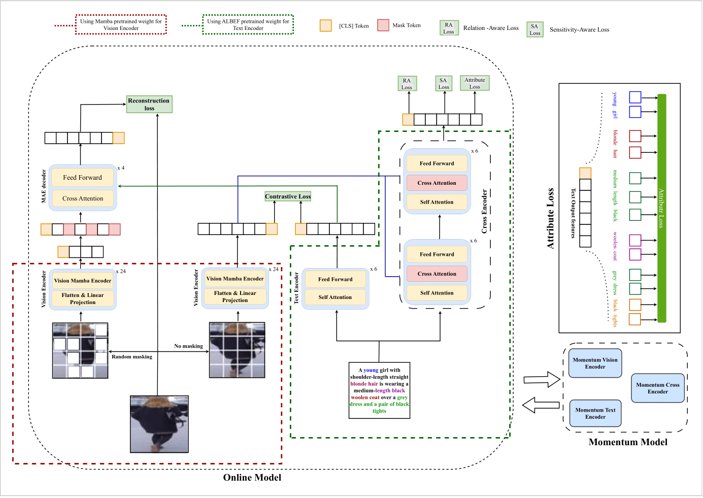
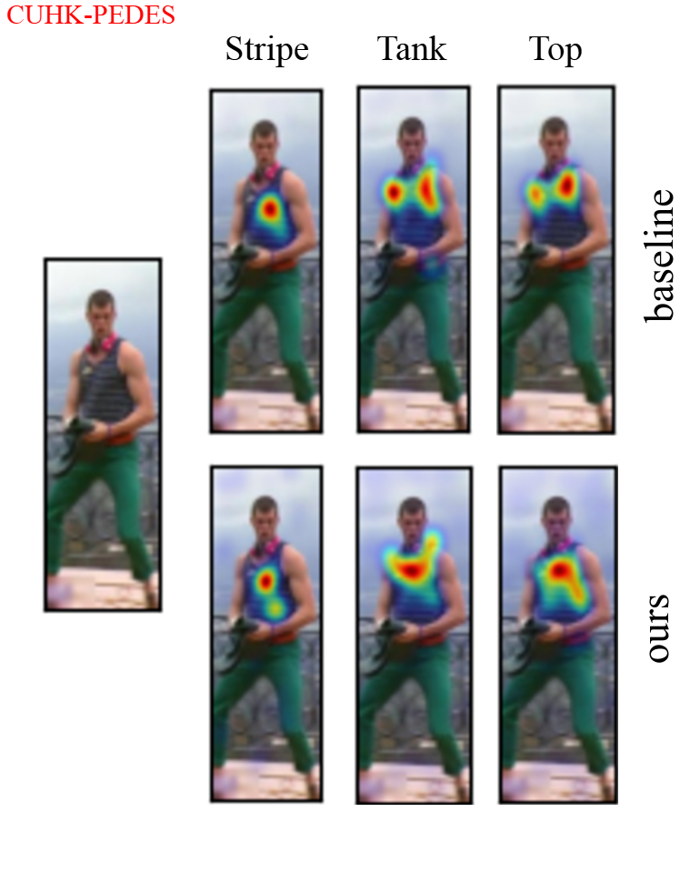
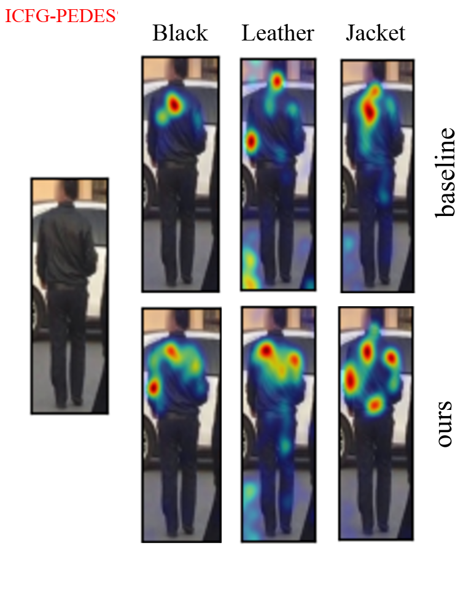
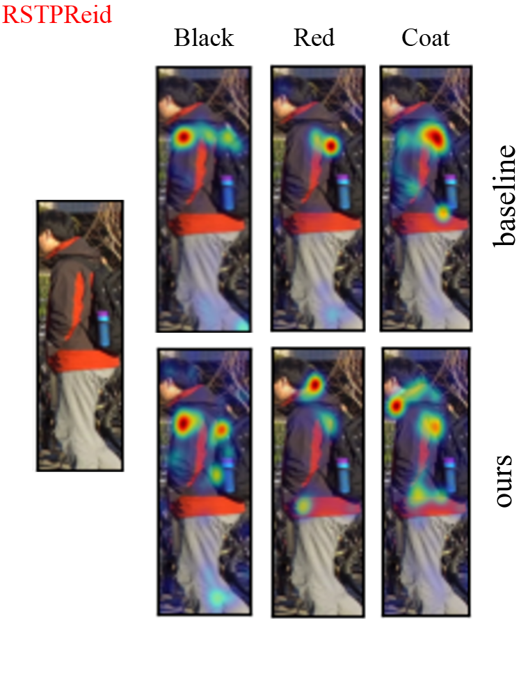

# MAMBA-TBPS NCVPRIPG 2025

## Overview
Text-Based Person Search (TBPS) represents a novel cross-modal retrieval approach focused on locating specific individuals within image collections through descriptive text queries. The primary challenge involves overcoming the semantic gap between visual and textual modalities while managing identity disambiguation and appearance variations. Our MAMBA-TBPS framework incorporates a comprehensive loss function framework derived from the foundational model, including Contrastive Loss, Relation-Aware (RA) Loss, Sensitivity-Aware (SA) Loss, Attribute Loss, and MAE-based Visual Reconstruction Loss. This integrated loss architecture allows our system to learn detailed cross-modal correlations, preserve attribute discrimination, and strengthen visual-textual correspondence, leading to enhanced retrieval accuracy. Performance validation across three standard TBPS datasets—CUHK-PEDES, ICFG-PEDES, and RSTPReid—shows that MAMBA-TBPS delivers competitive results.

.png)
Fig. 1: Left images (a and b) demonstrate intra-identity variations, showing how the same person appears differently across photos due to pose, lighting, or other factors. Right images (c and d) exemplify inter-identity variations, where one textual description could match multiple visually similar people, with only one being the correct target (marked in green) while the incorrect match is indicated in red.

## System Architecture

Fig. 2: Our proposed framework processes image-text pairs through dedicated visual and textual encoders, optimized via contrastive learning. A Masked Autoencoder (MAE) decoder reconstructs masked image regions. Text data flows through a cross-modal encoder incorporating visual features through cross-attention mechanisms. The system supports three optimization goals: relation-aware loss for image-text correspondence, sensitivity-aware loss for masked token prediction, and attribute loss targeting textual attribute encoding.

## Implementation Guide

### Dependencies:
To set up the Vision Mamba environment, clone and install the required libraries from: [https://github.com/hustvl/Vim](https://github.com/hustvl/Vim).

Execute these installation commands:

```bash
git clone https://github.com/hustvl/Vim
cd Vim
pip install -e causal-conv1d
pip install -e mamba-1p1p1
```

The training and evaluation pipeline has been verified to work with the specified dependency versions.

### Dataset Setup

For dataset preparation and downloading procedures, follow the guidelines provided in [RaSA](https://github.com/Flame-Chasers/RaSa/).

### Model Checkpoint
- Download the [pre-trained ALBEF model weights](https://storage.googleapis.com/sfr-pcl-data-research/ALBEF/ALBEF.pth).

### Model Training
Training scripts are available in the shell directory for each dataset.

Execute training for your chosen dataset:
```shell
# 1. CUHK-PEDES training
bash shell/cuhk_train.sh

# 2. ICFG-PEDES training
bash shell/icfg_train.sh

# 3. RSTPReid training
bash shell/rstp_train.sh
```

Remember to modify dataset paths in the corresponding ```.yaml``` configuration files before training.

### Model Evaluation

Evaluation scripts for each dataset are provided in the shell directory.

```shell
# 1. CUHK-PEDES evaluation
bash shell/cuhk-eval.sh

# 2. ICFG-PEDES evaluation
bash shell/icfg-eval.sh

# 3. RSTPReid evaluation
bash shell/rstp-eval.sh
```

Update checkpoint paths in the respective ```.sh``` files before running evaluations.

## Results Analysis

**Fig. 3:** Distribution of the 25 most frequently occurring nouns and adjectives


**Fig. 4:** Top-10 retrieval comparison between baseline and our approach demonstrates superior performance across multiple scenarios (examples a–d). In case (c), all retrieved images feature bicycles, unlike the baseline results. For example (e), despite missing the second-ranked result, our model retrieves more relevant images overall. In case (f), while no perfect match exists due to ambiguous description, the results maintain contextual relevance.

  

**Fig. 5:** Cross-attention visualization comparison between baseline (upper row) and our approach (lower row) using Grad-CAM analysis. The attribute loss component enhances attention precision and consistency across textual tokens.

### Academic Citation
Citation details will be provided upon publication:
```tex
Coming soon
```
